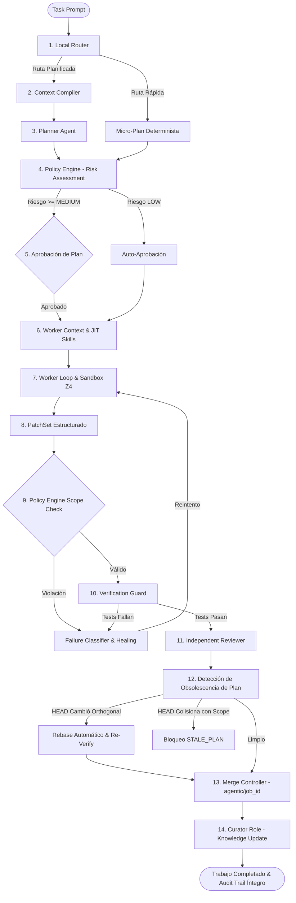

# MYA (myAgenticOS v2.2+)

[](https://www.python.org/downloads/)
[](http://mypy-lang.org/)
[](https://github.com/astral-sh/ruff)
[](https://docs.pytest.org/)
[](LICENSE)

> **Tú hablas con Mya. Los agentes hacen el trabajo. myAgentOS gobierna y garantiza la seguridad.**

```text
                     ╭─────╮
                     │ ◉ ◉ │
                     │  ◡  │   "Hola. Estoy en tu repositorio.
                     ╰─────╯    Dime qué quieres construir o investigar."
                      Mya
```

**MYA** es la voz, interfaz conversacional y presencia inteligente de **myAgentOS**, un **Sistema Operativo Agéntico para Ingeniería de Software** de grado de producción gobernado por contratos formales, seguridad de mínimo privilegio, evidencia verificable y preservación monótona de riesgo conforme a la especificación técnica [`docs/specification.md`](docs/specification.md).

A diferencia de los asistentes de código tradicionales que son meros envoltorios de un modelo de lenguaje y confían ciegamente en salidas no acotadas, **MYA** actúa como el puente inteligente entre el desarrollador y una infraestructura de agentes especializados estrictamente gobernados:

```text
                     AGENTIC OS
                         │
              ┌──────────▼──────────┐
              │        MYA          │  ◄── Tú hablas con Mya
              │       (LLM)         │      (Conversación, Explicación, Desambiguación)
              └──────────┬──────────┘
                         │ UserIntent tipado
              ┌──────────▼──────────┐
              │   JOB CONTROLLER    │  ◄── El Kernel decide y gobierna
              │    (FSM / Policy)   │      (Permisos, Riesgo, Sandbox, Verificación)
              └──────────┬──────────┘
                         │ Capability Tokens
              ┌──────────▼──────────┐
              │      AGENTS         │  ◄── Los agentes ejecutan en aislamiento
              │  (Planner, Worker,  │      (Worktrees efímeros, sin red por defecto)
              │   Reviewer, Curator)│
              └─────────────────────┘
```

### ¿Qué hace Mya única?

1. **Conversación Natural y Desambiguación Inteligente:** Interpreta instrucciones complejas en lenguaje natural ("añade autenticación", "optimiza las consultas lentas", "audita la seguridad"). Si una tarea es ambigua o presenta riesgos elevados, Mya no adivina: formula preguntas interactivas concisas con opciones claras antes de emitir la orden.
2. **Síntesis Determinista a `UserIntent`:** Mya traduce tus instrucciones en contratos formales de intención (`UserIntent`) que el Job Controller valida matemáticamente contra las políticas del proyecto.
3. **Observabilidad en Tiempo Real con Cero Tokens:** A través de comandos nativos como `/info`, `/telemetry` y `/monitor`, Mya proyecta el estado del repositorio, los archivos modificados y el consumo monetario directamente desde el `EventStore` criptográfico, con 0 overhead de tokens de modelo.
4. **Modos de Trabajo y Análisis Especializados:** Comandos slash organizados por familias de color y tipados con insignias:
   - 🟢 `/fast <prompt>`: Ruta rápida para tareas mecánicas seguras con mínima sobrecarga conversacional (auto-escala a planificada si detecta riesgo).
   - 🟡 `/sci_mode <prompt>`: Modo científico estructurado (Pregunta → Hipótesis → Metodología → Evidencia → Conclusiones).
   - 🔴 `/deep_research <query>`: Investigación exhaustiva en documentación, estándares y RFCs (**nunca modifica código por defecto**).
   - 🟡 `/optimize <target>`: Análisis riguroso de cuellos de botella y candidatos de optimización sin alteración automática.
   - 🟠 `/decision <pregunta>`: Reúne 5 perspectivas independientes (Arquitecto, Rendimiento, Seguridad, Mantenibilidad y Coste) mapeando acuerdos y discrepancias.
   - 🟡 `/security <prompt>`: Auditoría especializada de ciberseguridad y controles OWASP (solo puede elevar el riesgo de la tarea).
5. **Identidad Visual y Presencia Adaptativa (TUI):** Una interfaz terminal moderna construida sobre Textual y Rich con temas configurables (`default`, `minimal`, `high_contrast`, `monochrome`), control de microanimaciones (`/motion full|reduced|off`) y avatares con expresiones reactivas (`/avatar dot|glyph|ascii|minimal`).

Premisa fundamental de gobernanza:
> **Mya interpreta y propone; el núcleo determinista decide y ejecuta.**
Mya no concede permisos, no puede alterar unilateralmente el FSM de estados ni rebajar el nivel de riesgo de una tarea.

---

## Tesis Arquitectónica

```text
Enrutamiento Local Determinista
 └── Clasificación de Riesgo en Tres Fases (Preliminar ➔ Final ➔ Diff)
      └── Planificación Acotada & Micro-Planes Gobernados
           └── Compilación de Contexto Mínimo Suficiente (Token-Bounded)
                └── Workers Restringidos por Capability Tokens Desacoplados
                     └── Sandboxing Aislado sin Red por Defecto & Worktrees Efímeros
                          └── Verificación Determinista con Arnés Protegido
                               └── Revisión Independiente (Ceguera Estricta) & Aprobación Humana
                                    └── Merge Serializado en Rama de Job con Mutex Lock
                                         └── Memoria Continua Post-Merge Desacoplada (Curator)
```

---

## Flujo End-to-End del Sistema



---

## Subsistemas Principales y Garantías de Seguridad

### 1. Enrutamiento Local y Detección de Riesgo (§6)
- **Local-First sin coste LLM:** Enrutamiento determinista por prefijos (`/direct`, `/plan`, `/research`, `/doc`) y expresiones regulares.
- **Detección de Falsos Directos (*False-Direct Prevention*):** Tareas con disparadores `/direct` dirigidas a rutas críticas (`auth/`, migraciones DB, secretos) son escaladas forzosamente a `PLANNED_CODE` para impedir accesos desgobernados.

### 2. Máquina de Estados Finita (FSM) y Cadena Criptográfica (§8, §24)
- **FSM Determinista:** Estados formales (`ROUTING`, `PLANNING`, `WAIT_PLAN_APPROVAL`, `WORKER_LOOP`, `VERIFYING`, `FAILURE_CLASSIFY`, `INDEPENDENT_REVIEW`, `MERGING`, `KNOWLEDGE_UPDATE`).
- **Audit Trail Criptográfico SHA-256:** Cada evento se registra de forma inmutable en `.myagentos/jobs/{job_id}/events.jsonl`, vinculado al hash del evento anterior:
  $$\text{event\_hash} = \text{SHA256}(\text{event\_id} + \text{job\_id} + \text{state} + \text{prev\_hash} + \text{payload})$$
  Cualquier modificación o truncamiento es detectado de forma inmediata e irreversible.

### 3. Capability Tokens y Mínimo Privilegio (§5, §23, AUD-027)
- **Desacoplamiento en 4 Dimensiones:**
  - `read_scope`: Patrones glob de rutas legibles en el repositorio.
  - `write_scope`: Rutas autorizadas para creación/modificación (estrictamente limitadas al plan).
  - `execute_scope`: Comandos explícitos permitidos en el sandbox.
  - `network_scope`: Acceso a red deshabilitado por defecto (`NONE`).
- **Invariante Monótona de Riesgo:**
  $$\text{Riesgo}_{\text{efectivo}} = \max(\text{Riesgo}_{\text{actual}}, \text{Riesgo}_{\text{nuevo}})$$
  Ningún componente puede rebajar unilateralmente el nivel de riesgo asignado a un trabajo.

### 4. Compilador de Contexto y Cierre de Dependencias (§9)
- **Extracción AST sin Ruido:** Extracción estática de firmas públicas, interfaces y exports mediante Tree-sitter.
- **Cierre Transitivo de Dependencias:** Rastreo de imports locales que alimenta la detección de impacto cruzado y obsolescencia.
- **Redactor Determinista de Secretos:** Bloqueo y ofuscación automática de claves privadas, tokens y credenciales de producción antes de ser incorporadas a cualquier prompt.

### 5. Sandboxing Aislado y Worktrees Efímeros (§11, §16)
- **Drivers Pluggables:** `DockerSandboxDriver` (rootless, `--network none`, `--cap-drop=ALL`), `SubprocessDriver` y `MockSandboxDriver`.
- **Aislamiento en Worktrees:** Las modificaciones se ensayan en worktrees Git temporales en `.myagentos/worktrees/{job_id}`.
- **Merge Seguro:** Commits atómicos serializados bajo mutex lock en `.myagentos/merge.lock` hacia ramas dedicadas `agentic/{job_id}`.

### 6. Arnés de Verificación Protegido y Test Author (§13)
- **Restauración de Rutas Protegidas:** Antes de ejecutar cualquier test, [`VerificationGuard`](src/myagentos/verification/guard.py) restaura incondicionalmente desde `base_commit` todas las rutas protegidas (`tests/protected/**`, `conftest.py`, workflows de CI/CD), impidiendo que un worker debilite las aserciones de seguridad.
- **Manifiesto de Tests Obligatorio:** Verificación del recuento y nombres de los tests ejecutados contra la especificación aprobada.

### 7. Clasificador de Fallos y Auto-Sanación (§14, AUD-012)
- **Taxonomía Cerrada de Fallos:** Categorización determinista (`TEST_FAILURE`, `SYNTAX_ERROR`, `DEPENDENCY_ERROR`, `PROTECTED_TEST_MODIFIED`, `STAGNATION_DETECTED`, `RETRY_EXHAUSTED`).
- **Detección de Estancamiento:** Comparación de hashes de diffs entre iteraciones sucesivas para abortar bucles infinitos improductivos.

### 8. Revisor Independiente y Aprobación de Diff (§15, AUD-013, AUD-014)
- **Ceguera Estricta:** El revisor evalúa el `PatchSet` contra el `PlanSpec` sin acceso a los pensamientos internos, scratchpads ni trazas previas del worker.
- **Defensa Adversarial:** Inspección de alteraciones no declaradas, inyecciones de credenciales y desbordamiento de alcance.
- **Aprobación Humana de Diff:** Mandatoria para trabajos con riesgo `HIGH` o `CRITICAL`.

### 9. Rol Curator y Memoria Continua Post-Merge (§22, AUD-018)
- **Actualización Post-Merge No Bloqueante:** [`CuratorAgent`](src/myagentos/curator/agent.py) opera en la fase `KNOWLEDGE_UPDATE` tras consolidarse el merge.
- **Extracción Factual sin LLM:** Símbolos y relaciones extraídos con Tree-sitter.
- **Anclaje Obligatorio:** Notas estructuradas con anclas canónicas `archivo:símbolo@commit` o `archivo:linea@commit`.
- **Staging Aislado `_inbox/`:** Las notas se proponen en `.myagentos/vault/projects/{project_id}/_inbox/` con política create-only (tope de 3 notas por job y 8 KB por nota), escaneo determinista de secretos y transición automática a `stale` si commits posteriores modifican los archivos anclados.

### 10. Detección de Obsolescencia de Plan y Rebase (§8.4, AUD-025, AUD-026)
- **Regla Única Normativa de Obsolescencia:**
  $$\text{cambios} \cap (\text{scope} \cup \text{dependency\_closure} \cup \text{protected\_paths}) \neq \emptyset \implies \text{STALE\_PLAN}$$
- Si los commits concurrentes en el repositorio raíz son ortogonales, myagentos realiza un rebase automático en el worktree, re-ejecuta la verificación completa y emite el evento `BASE_REBASED`. Si colisionan, el plan es invalidado y se requiere replanificación.

### 11. Sistema de Skills Just-in-Time y Techos de Permiso (§20, AUD-027)
- **Principio Normativo de Techo:**
  $$\text{skill\_permissions} = \text{requested\_permissions} \cap \text{approved\_scope} \cap \text{project\_policy}$$
  Las skills declaradas o emparejadas Just-in-Time actúan estrictamente como un límite superior; nunca pueden expandir los permisos fuera del plan aprobado.
- **Rutas Protegidas Aditivas:** Las skills pueden incorporar rutas protegidas adicionales (`protected_paths_add`), pero jamás eliminar las existentes.
- **Elevación Monotónica de Riesgo:** `effective_risk` toma el valor máximo entre el riesgo base y el riesgo mínimo de las skills activas.

### 12. Arnés de Benchmark Empírico y Comparador Baseline (§26, §28)
- **Evaluación Científica:** Comparación bajo el mismo modelo LLM entre un `BaselineAgent` (asistente directo no gobernado) y `PipelineOrchestrator` de myAgentOS.
- **Dataset Estratificado:** Casos de prueba en 5 categorías: `LOW_MECHANICAL`, `FEATURE_MEDIUM`, `HIGH_AUTH_CRITICAL`, `ADVERSARIAL_SECURITY` y `PCA_CONTINUITY`.
- **Telemetría Completa:** Medición de latencia (p50/p95), tokens, coste estimado USD, tasas de defensa de políticas y preservación de integridad de la cadena criptográfica.

### 13. Mya: Interfaz Conversacional y Agente de Intención (`src/myagentos/mya/`)
- **Voz del Sistema Operativo:** Capa de diálogo inteligente que traduce lenguaje natural del usuario a `UserIntent` tipado, formula preguntas de aclaración cuando la tarea es ambigua y comenta la ejecución.
- **Invariante de Separación de Autoridad:** Mya nunca altera directamente la FSM, no emite Capability Tokens ni reduce unilateralmente el riesgo.

### 14. Categorización de Proyectos y Perfil Tecnológico (`src/myagentos/projects/`)
- **Taxonomía Jerárquica Multi-Label:** Detección de lenguajes, frameworks, tipos de aplicación y controles de calidad con puntuación de confianza y fuentes (`DETERMINISTIC`, `INFERRED`, `USER_PINNED`).
- **Caché y Validación de Cambios:** Persistencia en `.myagentos/project_profile.json` con hash de repositorio y detección automática de obsolescencia.

### 15. Project Manager y Project Explorer TUI (`src/myagentos/projects/`, `src/myagentos/ui/screens/projects.py`)
- **Registro Centralizado Multi-Proyecto:** Almacenamiento en `~/.myagentos/projects.json` con gestión de estado (`ACTIVE`, `TRASHED`, `ARCHIVED`).
- **Operaciones de Ciclo de Vida:** Añadir proyecto existente, crear nuevo desde plantilla, clonar repositorio Git remoto y papelera con recuperación o purga permanente.
- **Pantalla Interactiva `ProjectsScreen` (Ctrl+P):** Tabla de proyectos navegable, filtrado por tags o texto libre, acciones rápidas e inspección detallada.

### 16. Mya Commands & Observabilidad Determinista (`/info`, `/telemetry`, `/monitor`, etc.)
- **10 Comandos Formales por Familia:**
  - `UI_OBSERVABILITY` (Azul): `/info`, `/telemetry`, `/monitor`, `/status`, `/projects`.
  - `WORKING_MODE` (Verde): `/fast`, `/sci_mode`.
  - `RESEARCH_ANALYSIS` (Púrpura): `/deep_research`, `/optimize`, `/categorize`.
  - `DECISION_EXPERTISE` (Ámbar): `/decision`, `/cloud`, `/security`.
- **Cero Tokens de LLM para Métricas:** Proyecciones en tiempo real reconstruidas desde el `EventStore`.
- **Escalado Preventivo de Riesgo:** `/fast` escala automáticamente a `PLANNED_CODE` si el router detecta términos sensibles de producción.

### 17. Sistema Visual TUI, Animaciones y Character de Mya (`src/myagentos/ui/theme/`, `src/myagentos/ui/visual/`)
- **Símbolos Estándar y Redundancia:** Símbolos normativos (`○`, `◌`, `●`, `…`, `Ⅱ`, `!`, `✓`, `×`, `⊘`, `■`) con fallbacks textuales ASCII y badges de coste.
- **Sistema de Temas y Modos de Movimiento:** Temas `default`, `minimal`, `high_contrast`, `monochrome`; control de animación `full`, `reduced`, `off`.
- **Fundación de Personaje Desacoplada:** `MyaPresentationState` y `MyaRenderer` con modos `dot` (`● Mya`), `glyph` (`╭─ Mya ──╮`), `ascii` (avatar compuesto reactivo con expresiones faciales) y `minimal` (`[Mya]`).
- **Comandos de Presentación:** `/theme`, `/motion`, `/avatar`, `/compact`, `/dense`.

---

## Requisitos y Configuración de Entorno

- **Python:** `>= 3.12`
- **Gestor de Paquetes:** [`uv`](https://docs.astral.sh/uv/) (recomendado) o `pip`.
- **Git:** `>= 2.30`

### Instalación Rápida con `uv`

```bash
# Clonar el repositorio
git clone https://github.com/Andmo2004/myAgentOS.git
cd myAgentOS

# Crear entorno virtual y sincronizar dependencias
uv venv
source .venv/bin/activate
uv sync
```

---

## Guía de Uso del CLI (`myagentos`)

### 1. Ejecución Autónoma de Tareas (`run`)

Ejecuta el ciclo de vida completo (enrutamiento, planificación, sandboxing, verificación determinista, revisión y curación):

```bash
# Ejecución con auto-aprobación para entornos no interactivos
uv run myagentos run "Corrige la validación de tokens en src/auth.py" --auto-approve

# Especificar un modelo concreto registrado en el Gateway
uv run myagentos run "Añade tipado estricto a src/math_ops.py" --model mock
```

### 2. Inspección del Enrutador Local (`route`)

Inspecciona la clasificación de intención, regla aplicada y riesgo preliminar sin invocar inferencias externas:

```bash
uv run myagentos route "/direct fix typo in README.md"
uv run myagentos route "Refactor database migrations and foreign keys"
```

### 3. Estado del Trabajo y Auditoría Criptográfica (`status` y `verify`)

```bash
# Ver estado actual en la FSM, plan activo y recuento de eventos
uv run myagentos status job-d327c605

# Verificar matemáticamente la integridad de la cadena de hashes SHA-256
uv run myagentos verify job-d327c605
```

### 4. Arnés de Benchmark Empírico (`benchmark` o `bench`)

Ejecuta la suite de evaluación comparativa contra el agente baseline de referencia:

```bash
# Ejecutar suite rápida (smoke) con visualización de tablas comparativas
uv run myagentos benchmark --suite smoke

# Ejecutar suite de pruebas de seguridad y adversariales
uv run myagentos benchmark --suite security

# Exportar reporte estadístico completo a JSON
uv run myagentos benchmark --suite full --output reports/benchmark_full.json
```

### 5. Auditoría de Continuidad de Proyectos (`continue`)

Herramienta de diagnóstico de línea base (Project Continuation Audit - PCA):

```bash
# Diagnóstico estático y dinámico de salud del repositorio
uv run myagentos continue run --dynamic

# Generar informe formal de hallazgos
uv run myagentos continue report
```

### 6. Terminal Interactiva y Comandos de Mya (`mya`)

Lanza la terminal interactiva en Textual o ejecuta comandos de Mya directamente en la consola:

```bash
# Iniciar la terminal conversacional interactiva (TUI)
uv run myagentos mya
# o directamente:
./mya

# Ejecutar comandos de observabilidad deterministas sin overhead LLM
uv run myagentos mya /info
uv run myagentos mya /telemetry
uv run myagentos mya /monitor

# Ejecutar comandos de análisis especializado
uv run myagentos mya /fast "corrige error de sintaxis en src/cli.py"
uv run myagentos mya /deep_research "arquitectura de event sourcing vs CRUD"
uv run myagentos mya /decision "¿usar sqlite o jsonl para el registro local?"
uv run myagentos mya /security "auditoría de endpoints de autenticación"

# Configurar temas y avatares visuales
uv run myagentos mya /theme minimal
uv run myagentos mya /motion reduced
uv run myagentos mya /avatar ascii
```

### 7. Gestor de Proyectos y Project Explorer (`project`)

Administra repositorios locales y remotos registrados en `~/.myagentos/projects.json`:

```bash
# Listar proyectos activos y sus estados
uv run myagentos project list

# Registrar un proyecto existente
uv run myagentos project add /ruta/a/mi-proyecto --name "Mi Proyecto"

# Clonar un repositorio Git remoto
uv run myagentos project clone https://github.com/usuario/repo.git

# Inspeccionar tags de categorización de un proyecto
uv run myagentos project tags <project_id>

# Papelera: mover a papelera, listar, restaurar o purgar
uv run myagentos project trash move <project_id>
uv run myagentos project trash list
uv run myagentos project trash restore <project_id>
uv run myagentos project trash purge <project_id> --confirm
```

### 8. Categorización de Repositorios (`categorize`)

Escanea y genera el perfil tecnológico jerárquico del repositorio:

```bash
# Escanear el repositorio actual
uv run myagentos categorize

# Forzar re-escaneo ignorando caché
uv run myagentos categorize --force

# Exportar perfil completo en formato JSON
uv run myagentos categorize --json
```

---

## Estructura Modular del Proyecto

```text
myAgentOS/
├── src/myagentos/
│   ├── benchmark/           # Arnés empírico, baseline agent y dataset estratificado (§26, §28)
│   ├── continuity/          # Project Continuation Audit (PCA) y sintetizador de estado
│   ├── context/             # Compilador de contexto, closure de dependencias y sanitizador (§9)
│   ├── core/                # Modelos Pydantic v2 inmutables, errores y EventStore criptográfico
│   │   ├── models/          # RiskLevel, Event, CapabilityToken, PlanSpec, PatchSet, FailureRecord
│   │   └── store/           # EventStore append-only (SHA-256 hash chain) y StateProjector
│   ├── curator/             # Rol Curator, extracción Tree-sitter y vault de staging (§22, AUD-018)
│   ├── failure/             # Clasificador de fallos determinista y estrategias de curación (§14)
│   ├── fsm/                 # Controlador de ciclo de vida formal JobController y transiciones (§8)
│   ├── gateway/             # Model Gateway (Zona Z2), adaptadores OpenAI, Gemini y Mock (§7, §17)
│   ├── mya/                 # Mya: Interfaz conversacional, comandos especializados y character
│   │   ├── commands/        # Catálogo, registry, observabilidad determinista y handlers
│   │   ├── agent.py         # MyaAgent con diálogo, explicaciones y resolución de intención
│   │   └── presentation.py  # Presentation state y renderers (dot, glyph, ascii, minimal)
│   ├── pipeline/            # Orquestador integral PipelineOrchestrator y PipelineResult (§8)
│   ├── planner/             # PlannerAgent, esquemas estructurados de plan y micro-planes (§7)
│   ├── policy/              # PolicyEngine, enforcer de reglas de alcance y detector de señales (§5)
│   ├── projects/            # Multi-Project Manager, registro global y motor de categorización
│   │   ├── categorization/  # Taxonomía, detectores deterministas, inferencia LLM y selector
│   │   ├── models.py        # Project, ProjectProfile, ProjectTag, ProjectStatus
│   │   └── service.py       # ProjectManagerService con ciclo de vida completo y papelera
│   ├── reviewer/            # IndependentReviewer con ceguera estricta y aprobación de diff (§15)
│   ├── router/              # LocalRouter v0 con comandos slash y heurísticas de riesgo (§6)
│   ├── sandbox/             # Code Execution Sandbox (Zona Z4): Docker, Subprocess y Mock (§11)
│   ├── skills/              # Runtime de Skills Just-in-Time con techo de mínimo privilegio (§20, AUD-027)
│   ├── ui/                  # Interfaz TUI Textual, sistema visual, temas y pantallas interactivas
│   │   ├── screens/         # ProjectsScreen (explorador de proyectos)
│   │   ├── theme/           # Temas (default, minimal, high_contrast, monochrome), símbolos y animación
│   │   ├── visual/          # Control de movimiento, mapeador de estado de eventos y view models
│   │   └── widgets/         # MyaAvatar, MyaPanel, AgentTree, FileActivity, TokenMeter, JobMonitor
│   ├── verification/        # VerificationGuard, restaurador de protected_paths y manifest (§13)
│   ├── worker/              # WorkerLoop con ToolBroker y generador de parches atómicos (§10)
│   ├── worktree/            # Gestor de git worktrees efímeros y MergeController serializado (§11, §16)
│   └── cli.py               # Punto de entrada unificado de comandos de consola
├── tests/                   # 54 suites de pruebas automatizadas (unitarias, integración, UI, TUI, seguridad)
└── docs/                    # Especificaciones formales, arquitectura, manual CLI y guías de features
```

---

## Documentación Formal

Para profundizar en la arquitectura, la formalización matemática y los procedimientos de auditoría, consulte los documentos canónicos en el directorio [`docs/`](docs/):

| Documento | Descripción |
|---|---|
| [`docs/user-manual.md`](docs/user-manual.md) | **Manual de Usuario:** Instalación, configuración de claves API, referencia completa de todos los comandos slash de Mya, atajos de teclado y preguntas frecuentes. **Punto de entrada recomendado para nuevos usuarios.** |
| [`docs/specification.md`](docs/specification.md) | **Especificación Técnica Maestra (v2.1):** Arquitectura completa, estados de la FSM, sandboxing en 4 zonas, protocolo de parches y gobierno determinista. |
| [`docs/architecture.md`](docs/architecture.md) | **Arquitectura y Modelo de Amenazas:** Diagramas de aislamiento de zonas, transiciones de ciclo de vida, Capability Tokens, cadena criptográfica SHA-256 y matriz de mitigación de ataques. |
| [`docs/cli-reference.md`](docs/cli-reference.md) | **Manual de Referencia CLI:** Sintaxis, opciones, flags, códigos de salida y directorios de persistencia para todos los comandos de `myagentos`. |
| [`docs/benchmark-guide.md`](docs/benchmark-guide.md) | **Guía de Benchmark Empírico:** Metodología científica, métricas clave (§26), dataset estratificado en 5 categorías y comparación observable frente al agente baseline. |
| [`docs/technical-audit.md`](docs/technical-audit.md) | **Auditoría Técnica y Cumplimiento:** Análisis de discrepancias previas, tabla de hallazgos normativos y matriz de resolución de incidentes de seguridad. |
| [`docs/continuity-specification.md`](docs/continuity-specification.md) | **Auditoría de Continuidad de Proyectos (PCA):** Diagnóstico estático y dinámico de repositorios en transición, detección de deudas ocultas y síntesis de contexto. |
| [`docs/agentic-os-feature-cli-ui-mya.md`](docs/agentic-os-feature-cli-ui-mya.md) | **Especificación Mya Dialogue Agent & Interactive CLI/TUI:** Capa de conversación, desambiguación interactiva de intención y arquitectura de sesiones. |
| [`docs/agentic-os-feature-project-categorization.md`](docs/agentic-os-feature-project-categorization.md) | **Especificación Project Categorization & Profiling:** Taxonomía jerárquica de tecnologías, detección determinista + LLM y profiling de calidad. |
| [`docs/agentic-os-feature-project-manager-explorer.md`](docs/agentic-os-feature-project-manager-explorer.md) | **Especificación Project Manager & Explorer:** Registro centralizado multi-proyecto, operaciones de ciclo de vida (CRUD/trash) y pantalla interactiva `ProjectsScreen`. |
| [`docs/agentic-os-feature-mya-commands.md`](docs/agentic-os-feature-mya-commands.md) | **Especificación Mya Commands & Specialization:** Comandos slash especializados (/fast, /sci_mode, /deep_research, /decision), badges de categoría y observabilidad determinista. |
| [`docs/agentic-os-feature-tui-visual-mya-character.md`](docs/agentic-os-feature-tui-visual-mya-character.md) | **Especificación TUI Visual System & Mya Character:** Sistema de temas, microanimaciones de 0 tokens, reductor de movimiento, avatar desacoplado y widgets de monitoreo. |

---

## Calidad de Código y Validación

El proyecto aplica controles de calidad rigurosos y obligatorios en cada cambio:

```bash
# 1. Ejecución de la suite completa de pruebas (273 tests)
uv run pytest

# 2. Análisis estático de tipos con tipado estricto
uv run mypy src tests

# 3. Linter y formateador de código
uv run ruff check src tests
```

Estado actual del control de calidad:
- **Pytest:** `273/273 passed` (0 fallos).
- **Mypy:** `Success: no issues found in 145 source files` bajo `--strict`.
- **Ruff:** `All checks passed!` (0 advertencias).

---

## Licencia

Distribuido bajo la Licencia MIT. Consulta el archivo `LICENSE` para más información.
