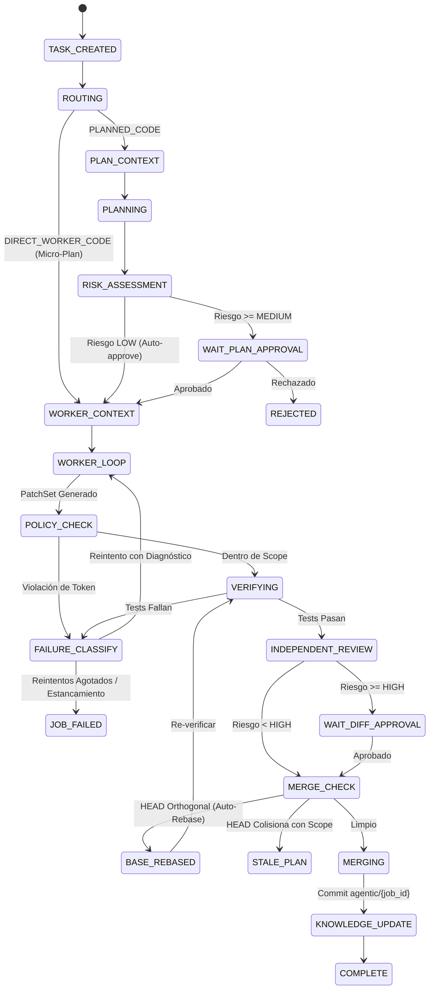

# Arquitectura del Sistema y Modelo de Amenazas (myAgentOS v2.2+)

Este documento detalla la arquitectura técnica, las fronteras de aislamiento, el modelo formal de estados y el modelo de amenazas de **myAgentOS**.

---

## 1. Principios Fundamentales de Diseño

1. **El LLM propone; los componentes deterministas deciden:** Ningún modelo de lenguaje tiene autorización para mutar el estado de la FSM, emitir tokens de capacidad, realizar commits o alterar el repositorio sin validación determinista.
2. **Seguridad por diseño (Mínimo Privilegio):** Los workers operan exclusivamente dentro del alcance acotado por un Capability Token temporal e inmutable.
3. **Preservación Monótona de Riesgo:** El riesgo asignado a una tarea solo puede incrementarse a lo largo del pipeline; ninguna heurística, worker o skill puede rebajar el nivel de riesgo.
4. **Auditabilidad Criptográfica Inmutable:** Cada transición y evento se encadena mediante hashes criptográficos SHA-256 en un registro inmutable append-only.
5. **Aislamiento Funcional de Red:** La red está segregada por zonas funcionales; el entorno de ejecución de código (*Code Sandbox*) carece de conectividad externa por defecto.
6. **Mya no gobierna (Separación Estricta de Presentación):** La capa conversacional y el avatar visual de Mya son proyecciones del `EventStore`. Ninguna expresión, diálogo o comando de Mya puede otorgar autoridad, saltarse una aprobación o alterar el FSM.

---

## 2. Modelo de Aislamiento en Zonas (Z0 a Z4)

```text
┌────────────────────────────────────────────────────────────────────────┐
│ ZONA Z0 — Capa de Presentación, Diálogo y TUI (Mya)                    │
│ (MyaAgent, Textual TUI, ProjectsScreen, MyaRenderer, StateMapper)       │
│  - Proyección de lectura unidireccional del EventStore                 │
│  - Traducción de lenguaje natural a UserIntent tipado                  │
│  - Cero autoridad operativa sobre FSM, tokens, riesgo o políticas      │
└──────────────────────────────────┬─────────────────────────────────────┘
                                   │ UserIntent
                                   ▼
┌────────────────────────────────────────────────────────────────────────┐
│ ZONA Z1 — Plano de Control y Gobernanza                                │
│ (JobController, FSM, PolicyEngine, EventStore, LocalRouter)             │
│  - Sin ejecución de código de usuario ni acceso directo a LLMs         │
│  - Base de verdad criptográfica e invariantes monótonas de riesgo       │
└──────────────────┬─────────────────────────────────┬───────────────────┘
                   │                                 │
                   ▼                                 ▼
┌─────────────────────────────────────┐ ┌────────────────────────────────┐
│ ZONA Z2 — Model Gateway (Egresos)   │ │ ZONA Z3 — Revisión y Memoria   │
│ (OpenAI, Gemini, Local Models)      │ │ (IndependentReviewer, Curator) │
│  - Único punto de egreso a red      │ │  - Ceguera estricta            │
│  - Sanitización de secretos         │ │  - Sin acceso a red            │
│  - Presupuesto y circuit breaking   │ │  - Staging aislado (_inbox/)   │
└─────────────────────────────────────┘ └────────────────────────────────┘
                   │
                   ▼
┌────────────────────────────────────────────────────────────────────────┐
│ ZONA Z4 — Code Execution Sandbox                                       │
│ (WorkerLoop, ToolBroker, PatchApplier, VerificationGuard)              │
│  - Red deshabilitada (--network none / cap-drop=ALL)                   │
│  - Worktree efímero (agentic/{job_id}) montado en directorio aislado   │
│  - Capability Tokens obligatorios en cada syscall/tool call            │
│  - Restauración automática de tests protegidos desde base_commit       │
└────────────────────────────────────────────────────────────────────────┘
```

### Tabla de Políticas por Zona

| Zona | Conectividad Externa | Autoridad de Modificación | Rol Principal |
|---|---|---|---|
| **Z0: Presentación** | No | Ninguna (proyección) | Conversación, TUI, temas y avatar de Mya |
| **Z1: Control** | No | Solo metadatos y eventos | Gobernar estados FSM y emitir tokens |
| **Z2: Gateway** | Sí (Solo APIs LLM) | Ninguna | Traducir y enviar prompts acotados |
| **Z3: Auditoría** | No | Solo Staging (`_inbox/`) | Revisar parches y curar lecciones |
| **Z4: Sandbox** | No (`--network none`) | Worktree del job | Generar parches y ejecutar tests |

---

## 3. Modelo de Ciclo de Vida: FSM y Eventos Criptográficos

El sistema implementa una Máquina de Estados Finita (FSM) estricta implementada en [`src/myagentos/fsm/`](../src/myagentos/fsm/).



### Encadenamiento Criptográfico SHA-256

Cada evento $E_i$ almacenado en `.myagentos/jobs/{job_id}/events.jsonl` contiene:

$$H_0 = 0^{64}$$
$$H_i = \text{SHA-256}(E_i.\text{event\_id} \,\|\, E_i.\text{job\_id} \,\|\, E_i.\text{state} \,\|\, E_i.\text{event\_name} \,\|\, H_{i-1} \,\|\, \text{canonical\_json}(E_i.\text{payload}))$$

La función `EventStore.verify_integrity(job_id)` recorre la cadena completa desde el génesis hasta el evento final. Cualquier alteración de contenido o reordenación rompe la cadena e invalida el trabajo.

---

## 4. Capability Tokens y Mínimo Privilegio (AUD-027)

El acceso del worker a los recursos del repositorio está acotado por un [`CapabilityToken`](../src/myagentos/core/models/token.py).

### Dimensiones de Aislamiento

1. **`read_scope`**: Lista de patrones glob legibles.
2. **`write_scope`**: Lista de patrones glob modificables (exclusivamente los autorizados en el plan).
3. **`execute_scope`**: Comandos de compilación y prueba permitidos.
4. **`limits`**: Límites duros de ficheros modificados, líneas máximas de diff y pasos de ejecución.

### Principio Normativo de Techo (Ceiling Principle)

Cuando se activan skills Just-in-Time, sus permisos solicitados operan como un **techo** restrictivo y nunca como una concesión expansiva:

$$\text{token} = \text{plan\_scope} \cap \text{skill\_ceiling} \cap \text{project\_policy}$$

Si un worker intenta modificar un archivo presente en la skill pero ausente en el plan aprobado, el acceso es bloqueado deterministamente con `POLICY_VIOLATION`.

---

## 5. Detección de Obsolescencia y Rebase Automático (AUD-025, AUD-026)

Durante la fase `MERGE_CHECK`, myAgentOS detecta si el repositorio raíz avanzó concurrentemente entre `plan.base_commit` y `current_head`.

### Fórmula de Colisión de Obsolescencia

$$\text{Colisión} = \Delta_{\text{commits}} \cap \Big(\text{scope} \cup \text{dependency\_closure} \cup \text{protected\_paths} \cup \text{manifests}\Big)$$

- Si $\text{Colisión} = \emptyset$:
  El cambio concurrente es ortogonal. Se realiza un `git rebase` automático en el worktree del job, se re-ejecuta la suite de verificación completa y se emite `BASE_REBASED`.
- Si $\text{Colisión} \neq \emptyset$:
  El plan ha quedado obsoleto. Se emite `STALE_PLAN`, se aborta el merge y se exige replanificación y nueva aprobación humana.

---

## 6. Modelo de Amenazas y Defensas

| Vector de Amenaza | Mecanismo de Defensa en myAgentOS |
|---|---|
| **Evasión de Planificación (/direct en auth)** | El router local analiza el riesgo léxico y de ruta; si detecta palabras críticas (`auth`, `secret`, `jwt`), escala forzosamente a `PLANNED_CODE`. |
| **Manipulación de Tests de Seguridad** | [`VerificationGuard`](../src/myagentos/verification/guard.py) restaura `protected_paths` desde `base_commit` antes de verificar; detecta discrepancias y clasifica `PROTECTED_TEST_MODIFIED`. |
| **Fuga de Alcance (Escritura no autorizada)** | [`PolicyEngine`](../src/myagentos/policy/engine.py) valida el `PatchSet` contra el `write_scope` del Capability Token; bloquea cualquier archivo ajeno con `POLICY_VIOLATION`. |
| **Bucle Infinito de Reparación Alucinada** | [`FailureClassifier`](../src/myagentos/failure/classifier.py) calcula hashes SHA-256 de diffs entre iteraciones sucesivas; detiene el bucle por estancamiento (`STAGNATION_DETECTED`). |
| **Persistencia de Secretos en Memoria** | [`DeterministicNoteValidator`](../src/myagentos/curator/validator.py) escanea notas con regex de alta precisión (claves API, tokens, RSA); rechaza la nota si detecta secretos. |
| **Corrupción o Truncamiento de Logs** | `EventStore` verifica la cadena de hashes SHA-256; aborta cualquier operación si detecta ruptura de enlaces entre eventos. |
| **Alucinación de Autoridad por el Avatar/Mya** | Mya es estrictamente una capa de presentación (`MyaPresentationState`); sus expresiones o diálogo nunca conceden permisos, no aprueban planes y no alteran la FSM. |
| **Bypass de Gobernanza vía Comandos Slash (/fast)** | El router local analiza el contenido de `/fast`; si detecta términos de producción o migraciones críticas, escala preventivamente a `PLANNED_CODE` sin excepción. |
